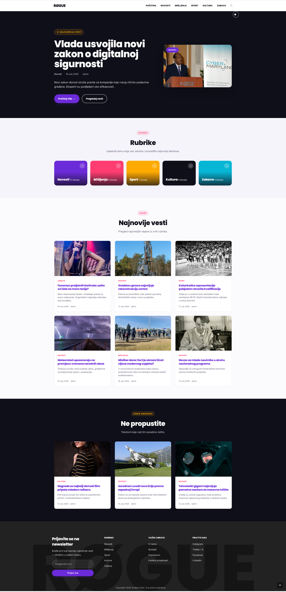
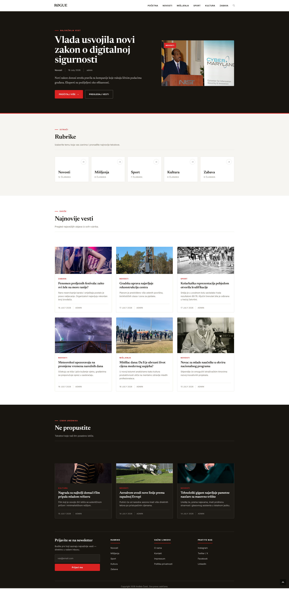

# Rogue

Rogue is a Serbian news portal built on WordPress. This repository holds two distinct stylistic directions for the Rogue theme. Both are fully realized, intentional designs that share the same underlying structure, but they offer completely different visual experiences. You can choose the one that best matches your publication's voice.

Both are child themes of [OceanWP](https://oceanwp.org/). Only one can be active at a time.

## The Two Versions

| Initial | Editorial |
| --- | --- |
|  |  |

**Rogue - Initial** (`wp-content/themes/rogue-initial`)

A vibrant, modern, and expressive take on digital publishing. This version features a bold purple and pink color palette, rounded pill buttons, and playful colored shadows for added visual depth. It also includes a custom cursor to give the portal a unique, memorable personality. It is intentionally crafted for lifestyle, culture, or entertainment content that thrives on a fresh, engaging, and highly stylized user experience.

**Rogue - Editorial** (`wp-content/themes/rogue-editorial`)

A timeless, sophisticated approach to news design that channels the elegance of traditional print journalism. It uses a refined ink-and-paper palette with a single red accent, pairing Newsreader for headlines with Inter for clean UI text. By avoiding gradients and using crisp hairline rules, it creates a distraction-free reading environment complete with serif body text and classic drop caps. It is perfectly suited for serious journalism and in-depth reporting where clarity and maximum readability are the top priorities.

## Repo layout

```
wp-content/themes/
  rogue-initial/      the original design
  rogue-editorial/    the editorial redesign
screenshots/          homepage captures of both versions
```

WordPress core is not included. These are themes, not a full site, so there is nothing here you do not own.

## Requirements

- WordPress 5.6 or newer
- The [OceanWP](https://oceanwp.org/) theme installed (it is the parent, both child themes need it)

## Install

1. Install the OceanWP theme first. It only needs to be installed, not active.
2. Copy one of the theme folders into `wp-content/themes/` on your site.
3. In wp-admin go to Appearance, then Themes, and activate either **Rogue - Initial** or **Rogue - Editorial**.

The theme creates the news categories (Novosti, Mišljenja, Sport, Kultura, Zabava) and a primary menu on the first admin visit. If the site has no posts yet, visit `?seed_demo=1` while logged in to load demo content, and `?seed_demo=clear` to remove it.

## Notes

- Frontend strings are in Serbian, translated in `functions.php` since the theme has no language files.
- Both versions share the same templates and class names. The difference between them is almost entirely `assets/css/news.css`, `assets/js/news.js`, and the font loading in `functions.php`, which makes the two folders easy to diff if you want to see exactly what changed between the two designs.
